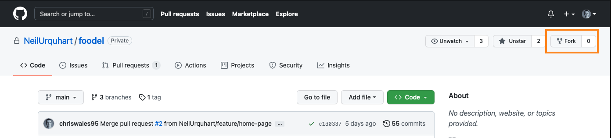

# Advanced Installation Guidance

If the installer provided does not suit ones' needs, it can be installed /
compiled manually. To compile Foodel, Java needs to be installed. It is also
recommended that Maven is installed too. 

* [Java](http://jdk.java.net)*
* [Maven](https://maven.apache.org/install.html)

## Compiling from source

Before beginning, you need a copy of the source code. Your choices are:
- Fork and clone the repository from GitHub
- Download an archive from GitHub and work without git integration

Example of GitHub cloning:
* click "fork" from repository


* from your repository, click the green "code" button and select the ssh method
  or whatever you're comfortable with.
  * If you haven't set up ssh keys and you're using the ssh method, then [do
    this
    now](https://docs.github.com/en/github/authenticating-to-github/connecting-to-github-with-ssh/generating-a-new-ssh-key-and-adding-it-to-the-ssh-agent).
    
* clone locally as so: `git clone git@github.com:your_user_name/your_repo.git` 
* Once you have the code, you'll need to navigate to the repository. 
* From there, you can prompt maven to fetch sources. It is easier to start with
  the optimiser project because the server project requires this.

```bash
cd optimiser
mvn compile install
```

* compile will make maven attempt to compile the project and install will make
  it available on our system to other projects. A good guide to maven can be
  found
  [here](https://maven.apache.org/guides/getting-started/maven-in-five-minutes.html).
* Next, navigate to the server project

```bash
cd ../server
mvn compile package
```
* The 'package' option creates the JAR and exe files.


## Launch the Server
Assuming no errors have occurred when compiling, the next step is to launch the
server.

This can be done as so:
```bash
java -jar target/server-X.X.X.jar
# replace the X's with the version number.
```

If you are on Windows, you can just launch the exe.

### Potential pitfalls

#### Ports already being in use
The only port required by Foodel is the server port. The default value is port
8080.

There are two options:
* Change Foodels port
* Stop the process already on the port


You can check ports being used like so (on Mac OS):
```bash
lsof -i:<PORT>

#This will return a process. You can then kill it like so 

kill <process_id>
```

To change Foodel's port, you can configure this via the `server.properties`
file. Change the value there and reload the server.


#### Jobs being publically accessible

If anyone can view job results without a key, you need to set the **nokey**
value in the `server/config` directory.

The *nokey* value determines if keys are required to view job results on the
Foodel server. This value should be *true* if you want results to not require
the key to view and *false* if you want keys to be required.


## Foodel's Structure and Customising Foodel's Look and Functionality

Naturally, some will want to change the look / functionality of the website.
This can be done by customising the necessary HTML, CSS, and JavaScript files.
How to find and edit these files is detailed below.

The basic structure of Foodel is: 
* optimiser
* server

The *optimiser* project can largely be ignored. 

The *server* project is structured as followed:

* config: This is where the standard HTML files are located
* public_html: This is where CSS / JS can be found
* src: This is where the Java code for the server resides
* logs: Log files are generated here

Both projects also have a *pom.xml* file which details the project dependencies
and how to build the project. 

To edit the look of Foodel, only the files in the config and public_html
directories need to be editied. The other directories can be ignored. If using
git, it is recommended that you work on a different branch in case you want to
go back to the original Foodel.

------
\* It is recommended that you use the latest version of Java which is Java 16 at
the time of writing.