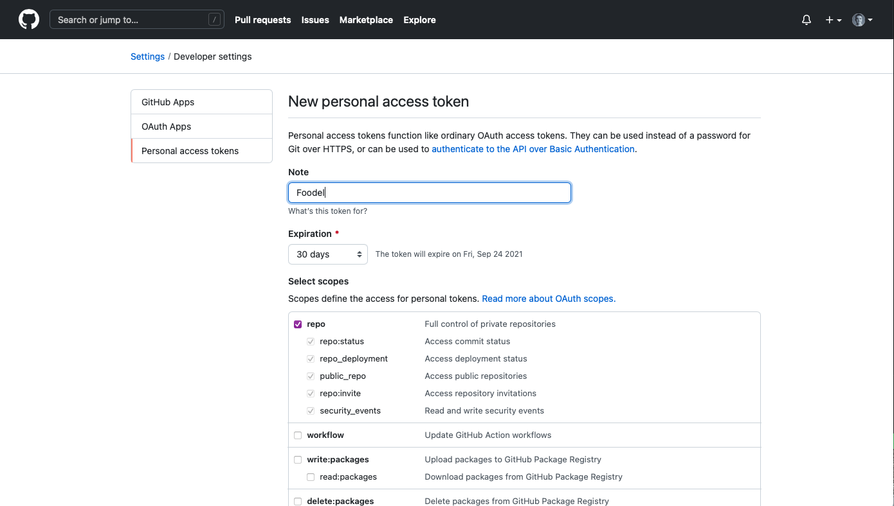

# Installer

## Intro

The installer allows a user to download a copy of Foodel onto their own system.
The code for this sytem is done in two parts: Java and JavaScript. Java handles
the server side code whilst JavaScript handles the user's experience on the
front-end.

The installer creates a zip archive containing a Foodel distribution. The
archive contains: a .exe or Jar (depending on choice), a JDK, sample problems
for new users, a server.properties file, and OSM data for the area of the users
choice.

The downloads are provided via GitHub. Artifacts are generated via Maven when
pull requests are merged or commits are pushed to the main branch. This is
handled via GitHub actions and is detailed more in the artifact generation
documents.

## Requirements

For the installer to work correctly, additional properties need to be specified
in `server.properties`. These are:

| Property         | Description                                                     |
| :--------------- | :-------------------------------------------------------------- |
| osm_data         | Where the sample osm files are located                          |
| sample_data      | Where the sample example files are                              |
| local_config     | Where the example local configuration is                        |
| shared_config    | Where the example shared configuration is                       |
| asset_repository | The GitHub repository where assets are located e.g. neil/foodel |

## Routes

The routes provided by the installer handler are:

- `/install`
- `/installer/create`
- `/installer/download`

`/install` is the main route and is a _GET_ only route. Users will visit here
and will fill out a form detailing their personal install. `/installer/create`
is a _POST_ route that users will submit their install requests to. The data of
their job is sent to the server which will then create their zip file. Once the
job is done, they will be presented with a link to `/installer/download`. The
user will be presented with a link to their unique download as a zip archive.

## Private GitHub Repositories

If the GitHub repository is private, Foodel will not be able to retrieve assets.
To deal with this, you can provide Foodel a Personal Access Token. This allows
Foodel to retrieve assets from private repositories (and do other things if you give it access). A token is also required if
there will be more than 60 requests within an hour without using authentication.

More details can be found here:
- https://docs.github.com/en/rest/guides/getting-started-with-the-rest-api#authentication
- https://docs.github.com/en/github/authenticating-to-github/keeping-your-account-and-data-secure/creating-a-personal-access-token

For Foodel, the only scopes required are the repository ones. It's worth keeping in mind the token expiration date. If you set an expiration date, you'll need to update the token. This can likely be automated somehow I'm sure. 

