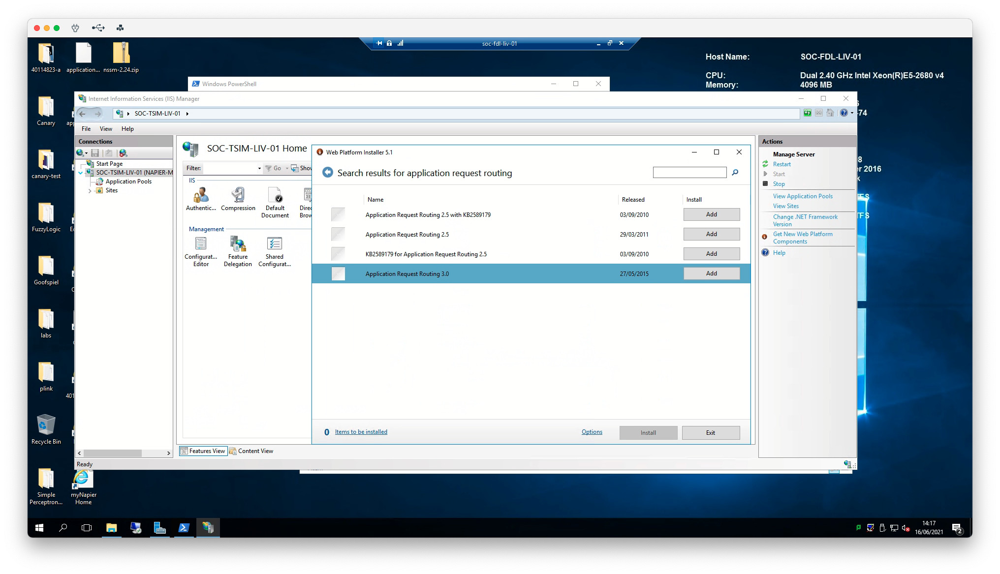
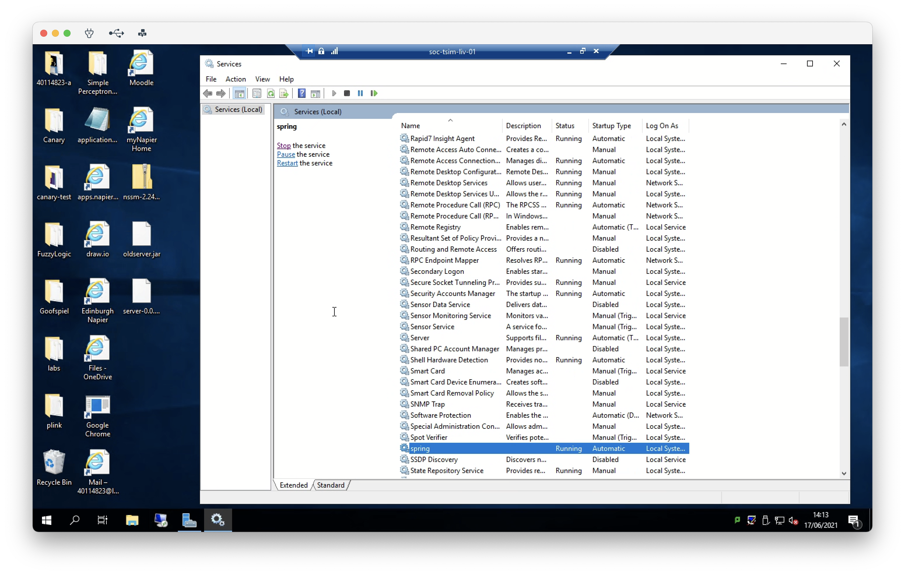

# Server setup

This document serves as a guide to proxying a Java application through to an IIS server on Windows Server. Feel free to
experiment with this guide and alter it. Personally, I'm more experienced with Linux servers; so there's undoubtedly
better ways to do this -- Chris.

## Software Requirements

The following will need to be installed on the server:

- [Java](http://openjdk.java.net)
- [NSSM](https://nssm.cc)
- [Microsoft Web Platform Installer](https://www.microsoft.com/web/downloads/platform.aspx)

## Setup Guide

- Install the software requirements listed above
- Add Java and Nssm executable to Windows PATH (optional but helps)

### IIS Setup

- Enable IIS if it's not already done. This is done from Windows Server Manager
  - Go to 'manage'
  - 'Add roles and features'
  - Follow the instruction wizard to install relevant IIS components
- Download and install the [Microsoft Web Platform Installer(https://www.microsoft.com/web/downloads/platform.aspx)
    - From this,
      install [Application Request Routing](https://www.iis.net/downloads/microsoft/application-request-routing). This
      will enable us to proxy our Java application from port 8080 (or whatever port) to 80


<p style="text-align: center">
  <em>
    Screenshot of installing the Application Request Routing plugin. 
  </em>
</p>

- From IIS, open the Web Platform Installer (red icon)
    - Go to the "applications" tab and search for "Application Request Routing" (ARR) and choose version 3.0
    - Follow install instructions. **You may need to exit and reopen IIS for the ARR menu(s) to appear.**
- Delete the default site on IIS
- Create a blank site. You shouldn't need to change any values in the form
    - You need to give it a path -- however -- it doesn't really matter where you put it
    - Create an empty folder somewhere and point it there.
    - Make sure to bind the site to a specific hostname otherwise you can access it by IP as well.
- From the main server menu, click into ARR.
- On the right-hand side, click ``server proxy settings''
    - Enable the proxy
    - Scroll to the field called "reverse proxy" and put the hostname and port of the application to proxy

### Java App Setup

- Place the JAR file of your application somewhere. A good place may just be the place where you pointed IIS to keep
  things simple.
- Create a windows service to start your app on restart / keep it running. Can be done via nssm.
- Run the following command from powershell

```powershell
nssm install <service_name> java -jar <path_to_jar> <additional_arguments>
```

For pimps, the following command was used:

```powershell
nssm install spring java -jar C:\inetpub\pimps\server-0.0.1.jar --spring.config.location=file:\\\C:\inetpub\pimps\application.properties
```

Notice how an additional parameter was used to specify an alternative properties file. This has specific overrides for
the server environment e.g. where to upload files, where to place experiments, and so on...

If you experience any issues, you can delete the service with the following:

```powershell
nssm remove <service_name>
```

You will need to stop the service before removing it.

To start / stop / pause the service, you can do this through the services application. Just search for "services" from
the start menu. Search for your service in the list and you should be able to start it etc from there.


<p style="text-align: center">
  <em>
    screenshot of services
  </em>
</p>
