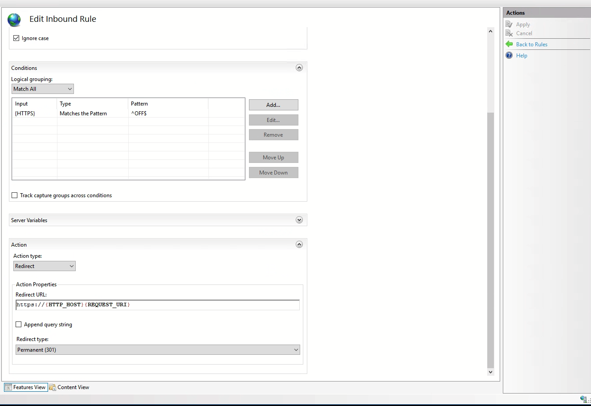

# Server setup

This document serves as a guide to proxying a Java application through to an IIS server on Windows Server. Feel free to
experiment with this guide and alter it. Personally, I'm more experienced with Linux servers; so there's undoubtedly
better ways to do this -- Chris.

## Software Requirements

The following will need to be installed on the server:

- [Java](http://openjdk.java.net)
- [NSSM](https://nssm.cc)
- [Microsoft Web Platform Installer](https://www.microsoft.com/web/downloads/platform.aspx)

## Setup Guide

- Install the software requirements listed above
- Add Java and Nssm executable to Windows PATH (optional but helps)

### IIS Setup

- Enable IIS if it's not already done. This is done from Windows Server Manager
    - Go to 'manage'
    - 'Add roles and features'
    - Follow the instruction wizard to install relevant IIS components
- Download and install the [Microsoft Web Platform Installer(https://www.microsoft.com/web/downloads/platform.aspx)
    - From this,
      install [Application Request Routing](https://www.iis.net/downloads/microsoft/application-request-routing). This
      will enable us to proxy our Java application from port 8080 (or whatever port) to 80


<p style="text-align: center">
  <em>
    Screenshot of installing the Application Request Routing plugin. 
  </em>
</p>

- Open IIS


- From IIS, open the Web Platform Installer (red icon)
    - Go to the "applications" tab and search for "Application Request Routing" (ARR) and choose version 3.0
    - Follow install instructions. **You may need to exit and reopen IIS for the ARR menu(s) to appear.**
- Delete the default site on IIS
- Create a blank site. You shouldn't need to change any values in the form
    - You need to give it a path -- however -- it doesn't really matter where you put it since we are proxying a Java
      application
    - Create an empty folder somewhere and point it there.
    - Make sure to bind the site to a specific hostname otherwise you can access it by IP as well.
    - When asked what bindings you want, you'll want HTTP and HTTPS most likely. These are port 80 and 443.


Bindings


Red ARR button


- From the main server menu, click the site you're working on under 'sites'
  - Click on URL Rewrite. This is how we will configure the reverse proxy and HTTPS.
  - On the right side, click add rules.
  - If you're proxying something, click on 'reverse proxy'. 
  - For HTTPS, I recommend this tutorial: https://www.ssl.com/how-to/redirect-http-to-https-with-windows-iis-10/ 
  - Once done, your rules will look like below. Note the rules order as this matters.


#### Reverse Proxy Settings
The reverse proxy rules are as follows:


#### HTTPS Settings



### Java App Setup

- Place the JAR file of your application somewhere. A good place may just be the place where you pointed IIS to keep
  things simple.
- Create a windows service to start your app on restart / keep it running. Can be done via nssm.
- Run the following command from powershell

```powershell
nssm install <service_name> java -jar <path_to_jar> <additional_arguments>
```

For foodel, the following command was used:

```powershell
nssm install foodelserver java -jar C:\Foodel2\server.jar
```

The server won't start unless the service is edited slightly further. I belive it's because the startup directory needs
to be specified. You can launch a GUI to do this:

```powershell
nssm edit foodelserver
```


If you experience any issues, you can delete the service with the following:

```powershell
nssm remove <service_name>
```

You will need to stop the service before removing it.

To start / stop / pause the service, you can do this through the services application. Just search for "services" from
the start menu. Search for your service in the list and you should be able to start it etc from there.


<p style="text-align: center">
  <em>
    screenshot of services
  </em>
</p>
